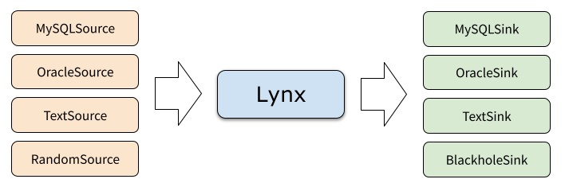

# Lynx



Lynx is a light-weight, command-line tool to transfer data between various structured or schemaless data sources.
It can also be used as a data export/import tool, for example, with a relational database as data source,
and text file as data sink, or vise versa. 

**This project is under heavy development now. USE IT AT YOUR OWN RISK.**
We are happy to see your contributions or suggestions.

## Quick Start

Lynx relies on a configuration file in YAML. Here is an example.

```yaml
# example.yaml
general:
  batchSize: 1000
  threads: 16
source:
  kind: text
  path: 'data/example.csv'
sink:
  kind: jdbc
  url: 'jdbc:mysql://127.0.0.1:3306/example'
  user: root
  password: 123456
  table: t1
``` 

Then you can run Lynx from terminal.

```bash
./lynx -c example.yaml
```

## Contribution

TODO
